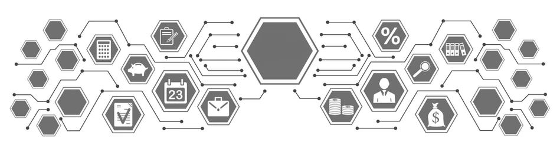

## Алгоритмизация и программирование

Методические материалы по курсу "Алгоритмизация и программирование" для студентов 2026 года поступления.

- [О курсе](01_О_курсе.md)
- [О преподавателях](02_О_преподавателях.md)
- [Лекционные занятия](./01_lectures/ReadMe.md)
- [Практические занятия](./02_practice/ReadMe.md)
  - [Задачи](./02_practice/01_tasks/ReadMe.md)
  - [Практические работы](./02_practice/02_practice_work/ReadMe.md)
  - [Групповые проекты](./02_practice/03_group_projects/ReadMe.md)
- [Материалы к экзамену](./03_exam/ReadMe.md)
- [Рекомендуемые источники](./04_sources/ReadMe.md)
